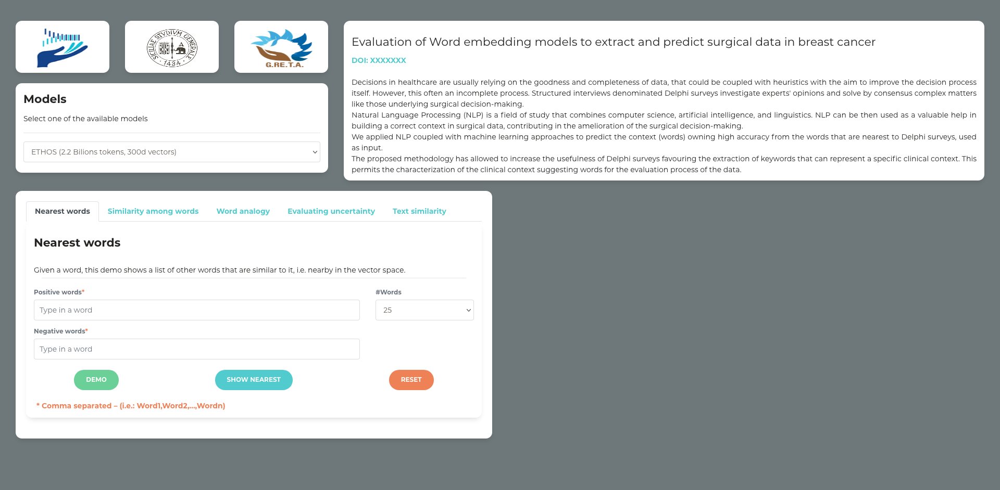

# ETHOS (fEatures TecHniques Outcomes Survey) - Word Embeddings


Decisions in healthcare are usually relying on the goodness and completeness of data, that could be coupled with heuristics with the aim to improve the decision process itself.  However, this often an incomplete process. Structured interviews denominated Delphi surveys investigate experts' opinions and solve by consensus complex matters like those underlying surgical decision-making. Natural Language Processing (NLP) is a field of study that combines computer science, artificial intelligence, and linguistics. NLP can be then used as a valuable help in building a correct context in surgical data, contributing in the amelioration of the surgical decision-making.<br>
We applied NLP coupled with machine learning approaches to predict the context (words) owning high accuracy from the words that are nearest to Delphi surveys, used as input. <br>
The proposed methodology has allowed to increase the usefulness of Delphi surveys favouring the extraction of keywords that can represent a specific clinical context. This permits the characterization of the clinical context suggesting words for the evaluation process of the data. 

Project link: <a href="https://combine.dmi.unict.it/ETHOS-word-embeddings/" target="_blank">https://combine.dmi.unict.it/ETHOS-word-embeddings/</a>



---

## Publications
#### Please cite our paper if you want to use the projet for your research.

#### DOI: [XXXX](XXXX)

#### BibTex format
```
COMING SOON
```

---

## Installation
```bash
git clone https://github.com/Pex2892/ETHOS-Word-Embeddings.git
```

## Setting Environment
A typical user can install the libraries using the following command:
``` bash
python3 -m pip install -r requirements.txt
```

# Run
You can test that you have correctly installed the project by running the following command:
```bash
python3 manage.py runserver
```
